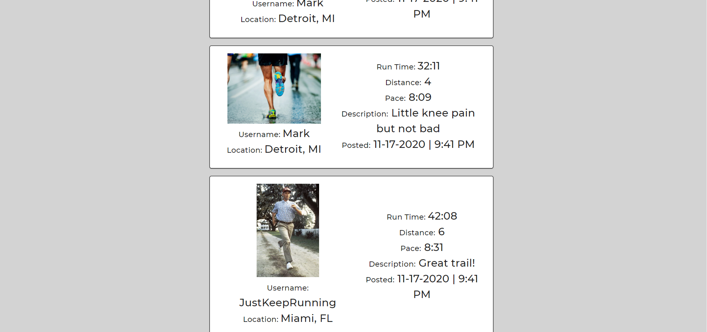
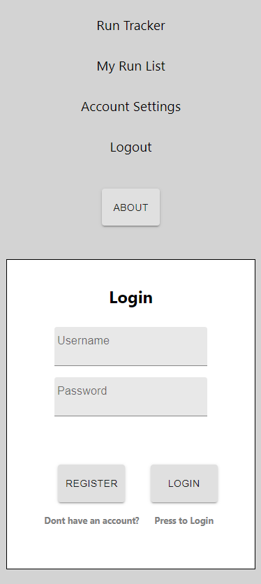

# Run Tracker FE

## Created By: Mark Loegel

## Documentation:

Deployed Link: https://run-tracker.vercel.app/ 
Back-End Deployed Link: https://run-tracker-be.herokuapp.com/ 
Back-End Github: https://github.com/meloegel/run-tracker-be 

## About

Run Tracker was created by Mark Loegel. Mark created Run Tracker because he has a passion for running as well as programming. Run Tracker keeps track of your run times and you able to post good runs to a main feed. Creating an account allows you to view your runs, edit and delete your runs and edit your profile. Thank you for using Run Tracker and Just Keep Running!

## Technologies Used

-React 
-React Router 
-Axios 
-Reactjs-popup 
-Reactstrap 
-Sass 
-Material Ui 
-Yup 

## File Structure

## Home Page

#### Description: On the home page you can view published runs in the main feed.

 
 

#### Description: All published runs will appear below

 
 

## Login/Register

#### Description: Basic Login and Register Pages

 
 

## My Run List

#### Description: On your run list page you can view all of your runs, in the top left a total of your milage and total runs is displayed. On your run list you can add runs, edit and delete runs.

 
 

## Add Run/Edit Run

#### Description: Basic edit and add run page. Note edit page autofills with previous information and publish button will toggle publshing run.

 
 

## Misc

#### Description: While logged into an account the home page will display a preview of your account rather than login/register buttons.

#### Description: While not logged into an account, you will be notified if trying to access an area you need to be logged into to view. (My Run List/Account Settings)

#### Description: Editing a user account will autofill previous information and in the top right your current account will be previewed.

#### Desctription: A live preview of your account updates displays at bottom of screen.

 
 

## Code Snippets

#### Description: Example of Axios with authentication

#### Description: Yup example

#### Description: Profile card example

#### Description: Format date and time

 
 

## Mobile Site

#### Description: Basic Mobile Home and Register

#### Description: Mobile home page

#### Description: Mobile My Run List and edit run
